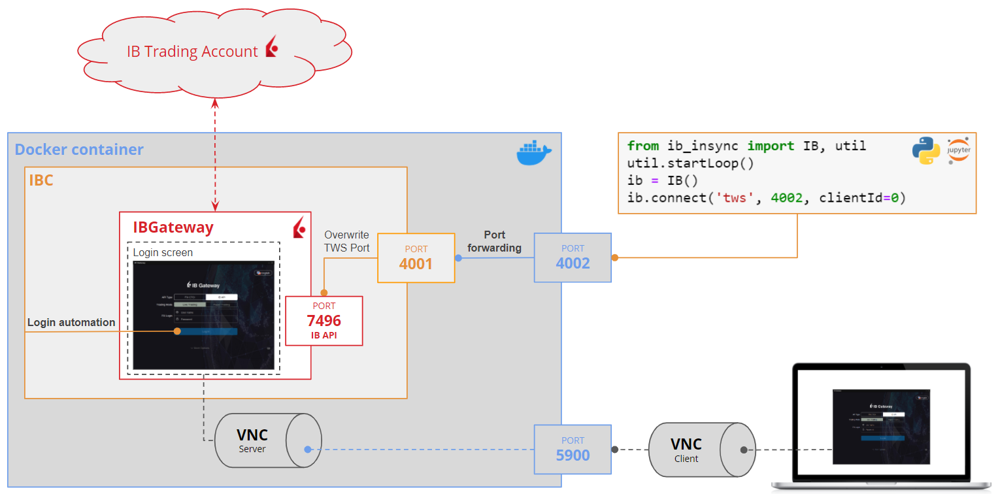
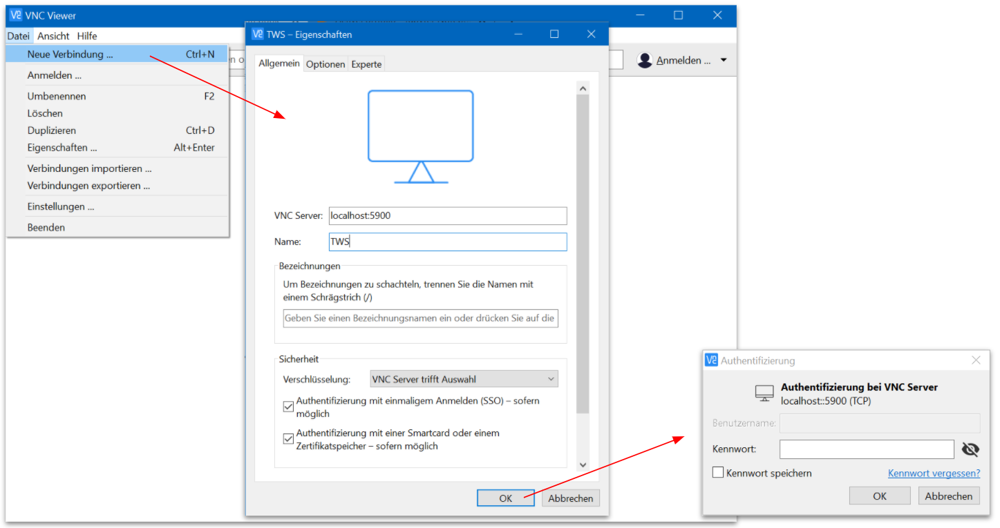

# ib-gateway-docker

### This Docker image combines IBC, IBGateway, and a VNC server

### Shortcomings of the native Interactive Brokers API
The native Interactive Brokers API (IB API - [Documentation](https://interactivebrokers.github.io/tws-api/initial_setup.html))
requires either a local installation of IB's Trader Workstation (TWS) or a local installation of IBGateway.
These two pieces of software make the IB API available on port `7496`. From there, 3rd party API wrappers like
[ib-insync](https://ib-insync.readthedocs.io/), which is a 3rd party python version if the IB API, 
connect to the Interactive Brokers trading platform to fetch data, execute orders, etc.

The way in which the native Interactive Brokers API is set up is not suitable for programmatic trading automation. When you
write code to analyze historic data and execute orders on your behalf, first, you don't want to install local software, and/or 
second, you don't want to put your username and password into a login screen before you run your code. Instead
, you want a headless API endpoint to which your program can send authenticated requests. 
This is where both [IBC](https://github.com/IbcAlpha/IBC/blob/master/userguide.md) and this repository come to your rescue.

### IBC (continuation of IBController)
IBC is built to enable headless authentication to the IBGateway so that you don't have to manually enter your
username and password into a login screen before your run your code. IBC loads the Gateway and then 'listens' for various events 
from IBGateway, such as the display of dialogs that would normally require user intervention. It can then automatically take 
appropriate action on the user's behalf. In particular, **it automates the IBGateway login** by filling the login dialog with the 
user's credentials and 'clicking' the login button.


### Architecture of this Docker image



IBC automates the login process, but it **does not deliver you from having to install IBGateway locally**. This is where this Docker image
comes to your rescu. It **wraps both IBGateway and IBC into a single Docker container**, wich means that both pieces of software will be installed
and live only inside the Docker container and not on your computer. This is great, but one major downside is that you can no longer
access the UI of the IBGateway, which lives inside the Docker container (e.g. if something with the login automation goes wrong and you need to
take a look and debug it). Therefore, this Docker image also **comes with a VNC server** which allows you to still have a look at the 
IBGateway login screen by using a local VNC client on your computer 
(e.g. [RealVNC](https://www.realvnc.com/en/connect/download/viewer/))

It tells IBC to override the default IB API port from `7496` to `4001` (it's just a one-line change in the `ibc_config.ini`-file).
and then forwards port `4001` to whatever port you specify using the `TWS_PORT` environment variable in the Dockerfile. Another 
**important environment variable** is `TRADING_MODE`, which can be set to either 'paper' or 'live' and governs whether your trades
are executed against your IinteractiveBrokers live trading account or your 'simulated' paper trading account.


### How to switch the between the paper- and the live trading mode of the IB API?
By setting the `TRADING_MODE` **environment variable** to either 'paper' or 'live' you can swich between the two modes of the IB API. 
However, before you can use the paper trading mode, you have to **enable paper trading by logging into your live account**, 
clicking the user icon at the top right > Manage Account > Paper Trading Account. There you specify a username and password
for your paper trading account and once done, you need to expose these credentials using the `IB_PAPER_USERNAME` and `IB_PAPER_PASSWORD`
environment variables. For your live trading credentials, use the  `IB_LIVE_USERNAME` and `IB_LIVE_PASSWORD` environment variables
expose your username and password. It is important to note that the live trading mode requires **two-factor authentication**. The
easiest way to have two factor authentication is by downloading the **IBTrader Mobile App** onto your phone.

## Building

```sh
docker build . -t ib-gateway-docker
```

## Running

```sh
docker run -p 4002:4002 -p 5900:5900 \
    --env TWSUSERID=YOUR_USER_ID \
    --env TWSPASSWORD=YOUR_PASSWORD \
    ib-gateway-docker:latest
```

This will expose port 4002 for the TWS API (usable with, e.g., [ib_insync](https://github.com/erdewit/ib_insync)) and 5900 for VNC (with default password `1358`). **Neither are secure for public internet access**, as the expectation is that private, secure services will sit on top and be the only open interface to the internet.

## Troubleshooting
### Streaming the IBGateway Login screen through a VNC client

1. Install a VNC client on your computer. In my case, I'm using [RealVNC](https://www.realvnc.com/en/connect/download/viewer/)
2. (optional) If you're **not** hosting ib-gateway on your local machine but on a **remote server** (e.g. Amazon AWS), 
   need to **tunnel port 5900** from that remote machine to your local computer by running the following command in
   from your shell:

   ```bash
   ssh -i <path-to-your-ssh-key> -L 5999:localhost:5900 <username>@<remote-host>
   ```
3. Open up your VNC client and connect to port `5900` on `localhost`. The **default VNC password** is 1234, but can be changed using the
   `VNC_PASSWORD` environment variable
   
